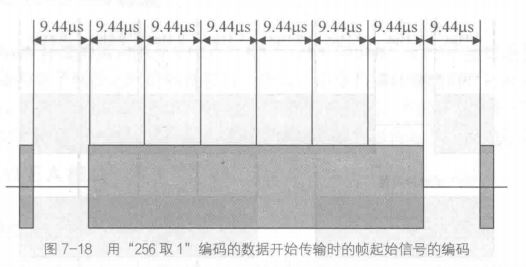
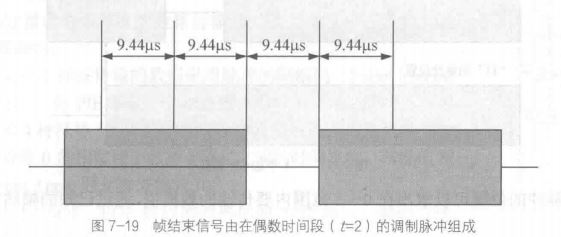
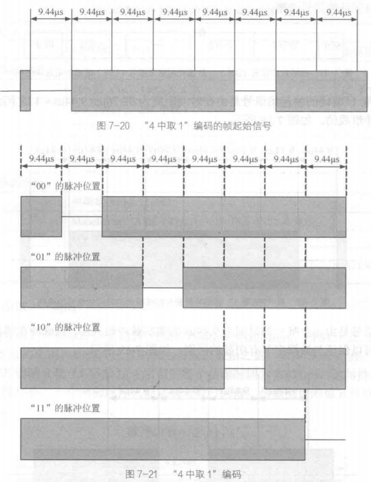

# 概述

​     **射频识别（**Radio Frequency Identification，RFID**）**

## 各类识别技术

| 自动技术 |             技术原理              |
| :------: | :-------------------------------: |
|   条码   |            **光**,编码            |
|   磁卡   |          **磁**,磁化极性          |
|   IC卡   | **电**,*微处理器*和大规模集成电路 |
|   射频   |             **无线**              |

还有**生物识别技术、图像识别技术、光学字符识别技术**等

<center>IC卡  vs  磁卡</center>
>   1.存储容量大
>
>   2.安全保密性好
>
>   3.具有数据处理能力
>
>   4.使用寿命长

## RFID

### RFID优点

>   1.标签抗污能力强
>
>   2.标签安全性高
>
>   3.标签容量大
>
>   4.可远距离,同时识别多个标签
>
>   5.是物联网的基石

### RFID标准

>   **ISO/IEC **,**EPC**, **UID**,AIM ,IP-X

### RFID组成

>   **电子标签、读写器（又称为阅读器）和数据管理中心 **


| 部件                         | 作用                                                         |
| ---------------------------- | ------------------------------------------------------------ |
| 电子标签(芯片与内置天线组成) | 芯片内保存有一定格式的电子数据，作为待识别物品的标识性信息，是射频识别系统真正的数据载体。<br />内置天线用于和射频天线间通信。 |
| 读写器                       | 控制射频模块向标签发射读取信号，并接收标签的应答，对标签的对象标识信息进行解码，将对象标识信息连带标签上其他相关信息传输到主机以供处理。 |
| 数据管理中心                 | 通常是一个装载了数据中心和控制软件的与读写器通过通信接口连接的PC或者工作站，主要完成数据信息的存储、管理及对射频标签进行读写控制。 |

### RFID的分类

| 分类依据 | 分类结果                                                     |
| -------- | ------------------------------------------------------------ |
| 耦合类型 | 电感耦合(*密耦合系统和**遥耦合系统***),电磁方向散射耦合(微波,电池) |
| 工作频率 | 1.低频（LF，频率范围为30kHz～300kHz）*125kHz*<br />2.高频（HF，频率范围为3MHz～30MHz）*13.56MHz± 7kHz*<br />3.特高频（UHF，频率范围为300MHz～3GHz）*433MHz、866MHz～960MHz和2.45GHz*<br />4.超高频（SHF，频率范围为3GHz～30 GHz）*5.8GHz和24GHz* 但目前24GHz基本不采用 |
| 供电方式 | 有源RFID系统,无源RFID系统,半无源RFID系统                     |
| 通信方式 |                             |

# 技术基础

## 读写器

>   ​     读写器是负责读取或写入标签信息的设备，~~读写器可以是单独的整体，也可以作为部件嵌入其他系统中。~~读写器由**天线**、**RF处理模块**、**控制处理模块**和**通信接口**组成。它的主要功能是通过电磁场对RFID标签进行读写操作，获取标签信息进而识别被标签附着的物体，并将信息通过通信网络上传至控制中心，同时读写器也能接收来自控制中心的命令并进行相应的操作.读写器还可提供相当复杂的信号状态控制、奇偶错误校验与校正功能等

## 标签

>    标签也叫作电子标签，一般由**半导体芯片**、**天线**及**电池**组成，供电方式决定是否有电池。它附着于被识别的物体上，与该物体一一对应，标签内部的半导体芯片内存有该物体的序列号、生产信息等数据。~~读写器通过与标签的无线电通信，读取这些数据，从而识别被标签附着的物体。~~

## 数据管理中心

>   数据管理中心通常是一个装载了**数据中心**和**控制软件**的与读写器通过通信接口连接的PC或者工作站，主要完成数据信息的存储、管理以及对射频标签进行读写控制。~~数据管理系统可以是市面上现有的各种大小不一的数据库或供应链系统，用户还能够买到面向特定行业的、高度专业化的库存管理数据库，或者把RFID系统作为整个ERP的一部分。~~*写入数据一般来说是离线完成的*，也就是预先在标签中写入数据，等到开始应用时，直接把标签粘附在被标识物体上。也有一些RFID应用系统，写数据是在线完成的  

## 基本原理


>   **（1）读写器将无线电载波信号周期性地通过天线向外部发射。**
>
>   **（2）电子标签进入读写器天线的有效工作范围后，电子标签被激活，将自身的信息发射出去。**
>
>   **（3）读写器的接收天线接收到标签的信号后，经过解调解码等操作，还原数据并通过通信接口传输给后台数据库系统。**
>
>   **（4）数据库系统根据一定的运算规则判断标签的合法性，并根据不同情况按照程序设定做出相应的判断和处理。**

## ~~电磁学技术~~

## ~~收发机~~

# 读写器技术


## 读写器作用

>（1）与**电子标签**之间的通信功能。
>
>（2）与**计算机**之间的通信功能。
>
>（3）对读写器与电子标签之间要传送的数据进行**编码、解码**。
>
>（4）对读写器与电子标签之间要传送的数据进行**加密、解密**。
>
>（5）能够在读写作用范围内实现多标签同时识读功能，具备**防碰撞**功能。

## 读写器工作频率


## 前端结构


>   （1）读写器天线上的电流最大，以使读写器线圈产生最大的磁通。
>
>   （2）功率匹配，以最大限度地输出读写器的能量。
>
>   （3）足够的带宽以使读写器无失真输出。

## 未来读写器发展

>   **1．多功能**
>
>   **2．小型化、便携式、嵌入式、模块化**
>
>   **3．低成本**
>
>   **4．智能多天线端口**
>
>   **5．更多新技术的应用**


# ~~标签技术~~

# 编码和调制

## 编码

### 256中取1

从调制脉冲时间位置可以求出在0~255值的范围内要传输的数据值，调制脉冲只能在奇数时间段（1，3，5，7，…）出现。由1字节的传输时间（4.833ms）得出数据传输速率为1.65kbit/s。

用规定的帧信号（帧起始——SOF，帧结束—EOF）表明数据传输的开始和结束

“256中取1”编码的帧起始信号是由在时间距离为37.76us（9.44us×4）之间的两个9.44us长的调制脉冲组成的，如图7-18所示。



帧结束信号是由一个唯一的时间为9.44us的调制脉冲组成的，该脉冲在偶数时间段内被发送，这样可以保证与数据字节有明显的区别，如图7-19所示。



### 4中取1

在“4中取1”编码的情况下，帧起始信号是由相距为37.76us，持续时间为9.44us的两个调制脉冲组成，如图7-20所示。在帧起始信号的第二个调制脉冲后，经18.88us的附加间歇后，便开始了有用数据的第一个字符，如图7-21所示。



## 调制

*   **调幅(AM)**,抑制载波的双边带调幅（DSBSC）,单边带调幅（SSBSC）
*   **调频(FSK)**
*   **调相(PSK)**

## 编码


### **曼彻斯特码在RFID中的应用特点**

>   曼彻斯特编码在比特长度内，“没有变化”的状态是不允许的。所以，在采用负载波的负载调制或者反向散射调制时，曼彻斯特编码通常用于从电子标签到读写器的数据传输，以**利于发现数据传输的错误**。

>   当多个标签同时发送的数据位有不同值时，则接收的上升边和下降边互相抵消，导致在整个比特长度内是不间断的负载波信号，由于该状态不允许，所以读写器利用该错误就可以**判定碰撞发生的具体位置**。

# 校验和防碰撞

## 差错控制编码

差错控制方式基本上分为反馈纠错和前向纠错两类。在这两类基础上又派生出一类称为混合纠错。

### 汉明码

**设海明码** **N** **位，其中数据位** **k** **位，校验位** **r** **位** **（冗余位）**

$$N=k+r \leq 2^r-1$$

(7，4)海明校验码中校验位和被校验信息位的排列如下：  

>海明码位号 Hj: $\color{red}1\:\:\:\:2\:\:\:\:3\:\:\:4\:\:\:5\:\:\:6\:\:7\:\:\:8\:\:\:9\:\:10\:\:11$
>
>P和b的分布：  $P_1\:P_2\:b_1\:P_3\:b_2\:b_3\:b_4\:P_4\:b_5\:b_6\:b_7$
>
>$P_1=b_1\bigoplus{b_2 \bigoplus{b_4\bigoplus {b_5 \bigoplus {b_7}}}}$
>
>$P_2=b_1\bigoplus{b_3 \bigoplus{b_4\bigoplus {b_6 \bigoplus {b_7}}}}$
>
>$P_3=b_2\bigoplus{b_3 \bigoplus{b_4}}$
>
>$P_4=b_5\bigoplus{b_6 \bigoplus{b_7}}$

### 奇偶校验

### CRC循环冗余校验

## 防碰撞


### 空分多路复用

>   **分离的空间**范围内实现多个目标识别 
>
>   空分多路法的缺点是天线系统复杂，会大幅度**提高成本**

### 频分时分复用

>   使用**不同载波频率**的调制信号在同时供通信用户使用的信道上进行传输的技术
>
>   缺点是导致读写器和标签**成本要求较高**,因此在RFID应用中，频分多路法很少使用 

###      **码分多路法**  

>   扩频技术包含扩频与多址两个基本概念。扩频目的是扩展信息带宽，即把需发送的具有一定信号带宽的信息数据，用一个带宽远大于其信号带宽的伪随机码进行调制，使原来的信息数据的带宽被扩展，最后通过载波调制发送出去。解扩是指在接收端采用一致的伪随机码，与接收到的宽带信号作相关处理，把宽带信号转换成原来的信息。
>
>     多址是给每个用户分配一个地址码，码型互不重叠。码分多路法具有抗干扰性好，保密安全性高，信道利用率高等优点。但是该技术也存在诸多缺点，如频带利用率低、信道容量小，伪随机码的产生和选择较难，接收时地址码捕获时间长等，所以该方法很难应用于实际的RFID系统中。

###      **时分多路法**

>   按传输信号的时间进行分割的  
>
>   广泛应用于包括计算机网络在内的数字通信系统  

### ALOHA


###      **二进制树型搜索算法**   

**二进制树型搜索算法由读写器控制，基本思想是不断的将导致碰撞的电子标签进行划分，缩小下一步搜索的标签数量，直到只有一个电子标签进行回应。**

>   二进制树型搜索算法的模型如图所示，其基本思想是将处于冲突的标签分成左右两个子集0和1，先查询子集0，若没有冲突，则正确识别标签，若仍有冲突则再分裂，把子集0分成00和01两个子集，依次类推，直到识别出子集0中所有标签，再按此步骤查询子集1。
>
>   可见，标签的序列号是处理碰撞的基础。
>
>   

#### **二进制树型搜索算法的实现步骤：**

>   （1）读写器广播发送最大序列号查询条件Q，其作用范围内的标签在同一时刻传输它们的序列号至读写器。
>
>    （2）读写器对收到的标签进行响应，如果出现不一致的现象（即有的序列号该位为0，而有的序列号该位为1），则可判断有碰撞。
>
>    （3）确定有碰撞后，把有不一致位的数最高位置0再输出查询条件Q，依次排除序列号大于Q的标签。
>
>    （4）识别出序列号最小的标签后，对其进行数据操作，然后使其进入“无声”状态，则对读写器发送的查询命令不进行响应。
>
>    （5）重复步骤1，选出序列号倒数第二的标签。
>
>    （6）多次循环完后完成所有标签的识别。

####      **动态二进制树型搜索算法的工作步骤**  :

>    （1）读写器第一次发出一个完整的查询条件Q，长度为N，每个位上的码全为1，让所有标签都返回各自的序列号。
>
>    （2）读写器判断有碰撞的最高位X，将该位置0。然后传输N～X位的数据。标签接到这个查询信号后检查自己的序列号是否匹配，如果匹配则回传自己序列号的X−1～0位。
>
>    （3）读写器检测第二次返回的最高碰撞位数X‘是否小于前一次检测回传的次高碰撞位数，若不是，则直接把该位置“0”；若是，则要把前一次检测的次高位也置为“0”。然后广播新的查询信息。发出查询条件的位数为N～X‘，满足查询条件的电子标签回传的信号只是序列号中最高碰撞位后的数，即X’−1～0位。若标签返回信号没有发生碰撞，则对该序列号标签进行读/写，然后使其进入“无声”状态。
>
>    （4）重复步骤（3），多次重复后可完成电子标签交换数据工作。

 ```flow
st=>start
op1=>operation: 射频卡进入读写器的工作范围，读写器发出一个最大序列号让所有射频卡响应；同一时刻开始传输它们的序列号到读写器的接收模块。
op2=>operation: 读写器对比射频卡响应的序列号的相同位数上的数。
op3=>operation: 把有不一致位的数从最高位到低位依次置O再输出系列号，即依次排除序列号大的数，至读写器对比射频卡响应的序列号的相同位数上的数完全一致时，说明无碰撞。
op4=>operation: 选出序列号最小的数后，对该标签进行数据交换，然后使该卡进入“无声”状态。
cond1=>condition: 出现不一致的现象
ed=>end
st->op1->op2->cond1
cond1(yes)->op3->op4->op1
cond1(no)->op4->ed

 ```


# 常用标准

 