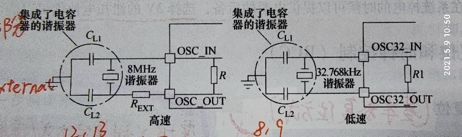
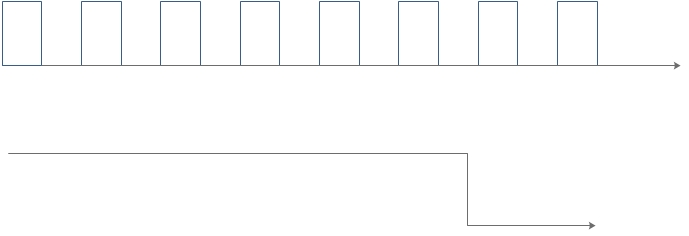

# 第一章

### **请对STM32F103VET6的整体性能进行描述。**

| 项目                  | 解读                                                         |
| --------------------- | ------------------------------------------------------------ |
| 内核                  | ARM 32-bits Cortex_M3 CPU核                                  |
| 最高频                | 72MHz                                                        |
| 处理能力              | 1####25DMIPS/MHz                                              |
| FLASH                 | 512KB FLASH 存储器(E)                                        |
| 电源和I/O输入电压范围 | 2####0~3####6V                                                 |
| 模数转换器            | 3个12位ADC,16通道                                            |
| 数模转换器            | 2个12位DAC,2通道                                             |
| GPIO                  | 80个,可忍受5V高压                                            |
| 调试                  | 串口调试(SWD)和JTAG端口                                      |
| 定时器                | 8个,TM1~TM8                                                  |
| 通信端口              | 13个,包括5个串口,2个$I^2C$, 3个SPI,1个CAN,1个USB 1个SDIO |
| FSMC                  | 有                                                           |
| 引脚数                | V(100pins)                                                   |
| 封装                  | T(LQFP)                                                      |
| 工作温度              | 6(-40$^{\circ}$C~85$^{\circ}$C)                              |

### Cotex-M3内核访问Flash的方法有几种，请分别描述。

* 通过ICode总线访问闪存接口来访问flash,进行指令预存储
* 通过DCode总线连接总线矩阵和flash进行访问,进行常亮加载和调试访问

### STM32支持的存储空间是多大，其中FLASH和RAM的最大存储空间分别是多少？

| 类型  | 大小 |
| ----- | ---- |
| flash | 512K |
| ram   | 64K  |

### STM32中FLASH存储区在存储映射图中的起始地址和长度分别是多少？并计算该存储区的大小。

flash起始地址为0x8000000,大小为0x80000$\rightarrow$524288字节

### STM32中SRAM存储区在存储映射图中的起始地址和长度分别是多少？并计算该存储区的大小。

ram起始地址0x2000000,大小为0x10000$\rightarrow$65536字节

### STM32F103VET6有多少个GPIO引脚？请列举6中不同的GPIO复用功能（中英文名）。

有80个GPIO引脚

| 中文名               | 英文名     |
| -------------------- | ---------- |
| 端口配置低寄存器     | GPIOx_CRL  |
| 端口配置高寄存器     | CPIOx_CRH  |
| 端口输入寄存器       | CPIOx_IDR  |
| 端口输出寄存器       | CPIOx_ODR  |
| 端口位设置清除寄存器 | GPIOx_BSRR |
| 端口位清除寄存器     | CPIOx_BRR  |
| 端口锁定寄存器       | CPIOx_LCKR |

ADC123_IN10 WKUP USART_CTS  TIM2_CHI_ETR SPI1_NSS DAC_COUT1

### 请描述STM32F103VET6的电源供电类型各类型电源的电压范围 引脚数量及系统最大功耗。

| Q                  | A    |
| ------------------ | ---- |
| 电源供电类型       | VDD  |
| 各类电源的电压范围 |      |
| 引脚数目           |      |
| 系统最大消耗       |      |

### 请列举4种STM32F103VET6的复位功能。

* 上电复位
* 掉电复位
* 系统复位
* 备份区域复位
* 待机复位
* 返回复位

### STM32芯片时钟源有哪些？

* 内部高速HSI
* 内部低速LSI
* 外部高速HSE
* 外部低速LSE
* PLL

### 请分别画出STM32F103VET6的高,低速外部晶体振荡电路，并注明时钟电路的元件参数。

### STM32系统时钟SYS_CLK的时钟源选择有哪些？

HIS,HSE,PLL

### 外部高速外设时钟主频为5M，若采用该时钟进行倍频，可获得的最高PLLCLK是多少？并说明原因。

最高可获得PLLCLK的频率为$5\times 14=70MHz$,因为HSE最高主频为72MHZ

### STM32的主时钟输出MCO的时钟源有哪些？

可选用PLLCLK,SYSCLK,HSI,HSE作为时钟输出

### 列举6种通用输入输出GPIO口的工作模式。

* 输入浮空
* 输入上拉
* 输入下拉
* 模拟输入
* 开漏输入
* 推挽输入

### STM32F103VET6的模拟数字转换（ADC）精度是多少位？最多可以测量多少个外部模拟量？

| 精度 | 测量数量 |
| ---- | -------- |
| 12位 | 21个     |

### 假设ADC的供电电压是3.3V,参考电压是3.0V，通道1寄存器采样值为1038，请问通道1对应引脚的实际输入电压是多少？并给出计算过程。

$\frac{1038}{2^{12}-1}\times 3=0.7604V$

### STM32F103VET6有多少个可屏蔽中断通道？请列举5种不同的中断方式。

有68个可屏蔽中断通道

硬件失效中断,总线管理中断,错误应用中断,窗口定时器中断,闪存全局中断

### 请简要描述STM32中DMA的特征。

每个通道都直接连接专用的硬件DMA请求，每个通道都同样支持软件触发。这些功能通多软件来配置。在七个请求间的优先权可以通过软件编程设置（共有四级：很高、高、中等和低），假如在相等优先权时由硬件决定（请求0优先于请求1，以此类推）。独立的源和目标数据区的传输宽度（字节8、半字16、全字32），模拟打包和拆包的过程。源和目标地址等.

### 已知USART1_TX位于DMA1的通道4，I2C1_TX位于DMA1的通道6，USART2_TX位于DMA1的通道7，若三个外设端口同时请求DMA1发送数据，请问DMA1优先响应哪个外设，并说明理由。

优先响应USART2_TX

冲裁依据通道号排列优先级,通道号4最小

### 已知STM32主频72M，APB2预分频因子为4，通用定时器TIM2采用向上计数模式时，该如何设置预分频器和自动装载寄存器才能实现200ms？若采用向上/向下计数模式计算，又该如何设置预分频器和自动装载寄存器？请分别给出计算过程。（设置合理计算过程正确即可）

计数器最大技术65535

主频72M表示每秒$72\times 10^6$次,一次的时间为$\frac{1}{72M}s$

要实现200ms计时,需要计数器计数$>65535$

所以我们需要进行分频,设置预分频值为999,进行1000分频,则此时频率为72kHz,则设置自动装载寄存器设置14400

### 请描述SPI通信的4个引脚的功能。

| 引脚 | 功能                                                         |
| ---- | ------------------------------------------------------------ |
| MISO | 主设备输入/从设备输出引脚。该引脚在从模式下发送数据，在主模式下接收数据 |
| MOSI | 主设备输出/从设备输入引脚。该引脚在主模式下发送数据，在从模式下接收数据 |
| SCK  | 串口时钟，作为主设备的输出，从设备的输入                     |
| NSS  | 从设备选择。这是一个可选的引脚，用来选择主/从设备。它的功能是用来作为“片 选引脚”，让主设备可以单独地与特定从设备通讯，避免数据线上的冲突 |

### 请描述SPI主/从机发送或接受数据位和时钟周期的关系。

 一个SCK时钟周期内

主机通过MOSI线发送一位数据，从机通过该线读取这一位数据

从机通过MISO线发送一位数据，主机通过该线读取这一位数据

### 请描述I2C通信中数据线SDA上起始位,数据位,停止位和时钟SCL的关系？

| 串行数据线SDA | 负责在设备间传输串行数据 |
| ------------- | ------------------------ |
| 串行时钟线SCL | 负责产生同步时钟脉冲     |

| 位| 描述|
| ---- | -----|
| 起始位|SCL为高电平时，SDA由高电平向低电平跳变，开始传送数据，数据传输过程中只有在SCL线为低电平期间，SDA上的电平允许变化 |
| 数据位 |在开始信号之后，SDA和SCL先都处于低电平，当要传输数据时SDA先为高，之后SCL再跳变为高，才可进行数据的传输 |
| 结束位 |SCL为高电平时，SDA由低电平向高电平跳变，结束传送数据 |

### I2C通信在标准,快速和高速下的传输速率分别是多少？

| 速度 | 频率   |
| ---- | ------ |
| 标准 | 100kHz |
| 快速 | 400kHz |
| 高速 | 3,4mHz |

### 请按位描述8位字长UART通信的数据帧格式，并画出数据0x3F的时序图。

8位字节:起始位+0-6个数据位+[奇偶校验位]+停止位

