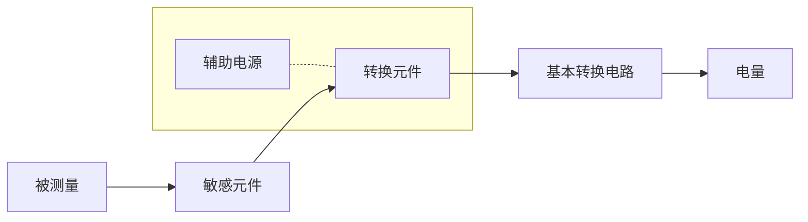

# 绪论

### 传感器的组成

|       部分       |                             功能                             |
| :--------------: | :----------------------------------------------------------: |
|   **敏感元件**   | **直接感受被测量，并输出与被测量成确定关系的某一物理量的元件。** |
|   **转换元件**   |   **敏感元件的输出就是它的输入，它把输入转换成电路参量。**   |
| **基本转换电路** | **上述电路参数接入基本转换电路（简称转换电路），便可转换成电量输出。** |

### 传感器的分类

| 分类依据 |                           分类结果                           |
| :------: | :----------------------------------------------------------: |
| 工作原理 |        **物理型**:结构型,物性型,**化学型**,**生物型**        |
|  被测量  | **力学量、温度、磁学量、光学量、流量、湿度、浓度、气体成分等** |

## 传感器特性

### 静态特性

>   **静态特性：当输入量为常量，或变化极慢时的关系**

1.  **==静态误差==**

>   静态误差是指传感器在其全量程内任一点的输出值与其理论值的偏离程度。
>
>   静态误差的求取方法：把全部输出数据与拟合直线上对应值的残差,看成是随机分布,求出其标准偏差,即                                                                                                                                                                                                                                                                                                                                                                                                                                                                                                                                                                                                                                                                                                                                                                                                                                                                                                                                                                                                                                                                                                                                                                                                                                                                                                                                                                                                                                                                                                                                                                                                                                                                                                                                                                                                                                                                                                                                                                                                                                                                                                                                                                                                                                                                                                                                                                                                                                                                                                                                                                                                                                                                                                                                                                                                                                                                                                                                                                                                                                                                                                                                                                                                                                                                                                                                                                                                                                                                                                                                                                                                                                                                                                                                                                                                                                                                                                                                                                                                                                                                                                                                                                             
>
>   $\color{red}{\sigma=\sqrt{\frac{1}{n-1}\sum_{i=1}^{n}(\Delta y_i)^2}}$
>
>   静态误差也可用相对误差来表示，即 :
>
>   $\color{red}{\gamma=\pm(3\sigma/y_{FS})}$
>

### 动态特性

>   **动态特性：当输入量随时间较快地变化时的关系**

**零阶**

$y(t)=kx(t)$

**一阶**

>   由**一个储能元件**(上次测量会影响下一次的测量值),**耗能元件**构成,其响应公式和传递函数:

$a_1\frac{dy(t)}{dt}+a_0y(t)=x(t)$$\Rightarrow \frac{Y(s)}{X(s)}=\frac{K}{\tau s}$

>   其中,$k=1/a_0$,为静态灵敏度,$\tau=a_1/a_0$是传感器的时间参数,是$y(t)$上升到$y_s$的63%所需的时间

**二阶**

由**两个储能元件**(上次测量会影响下一次的测量值),**耗能元件**构成

参数有$\xi$阻尼,$\tau$时间参数,$k$静态灵敏度

## 技术措施

>   **差动**(提高灵敏度,减小非线性),**累加平均**,**补偿与修正**,屏蔽隔离与干扰抑制,稳定性处理

# 力传感器

## 应变式传感器

### 应变效应

>   $R=\rho\frac{l}{S}\Rightarrow\frac{dR}{R}=\frac{d\rho}{\rho}+\frac{dl}{l}-\frac{dS}{S}$
>
>   $\frac{dR}{R}=\frac{d\rho}{\rho}+\frac{dl}{l}-\frac{dS}{S}=\frac{d\rho}{\rho}+\frac{dl}{l}(1+2\mu)=\frac{d\rho}{\rho}+\varepsilon(1+\mu)$
>
>   最后:$\frac{\Delta R}{R}=(1+2\mu+\frac{\Delta\rho/\rho}{\Delta l/l})\frac{\Delta l}{l}=K_S\varepsilon\\(\varepsilon=dl/l)$
>
>   其中$K_S$成为金属丝的应变灵敏系数,对金属材料$K_S\approx 1+2\mu$
>
>   半导体材料主要由$\frac{\Delta\rho/\rho}{\Delta l/l}=\pi E$(电阻相对变化)决定,其中$\pi$压阻系数,$E$弹性模量

### 丝式应变片

>   **优点**:制作简单,价格便宜,易安装
>
>   **缺点**:横向效应大,测量精度差,性能分散

组成:敏感栅,基地,盖片,引线,粘结剂

#### 特性分析

| 效应             | 原理                                                         |
| ---------------- | ------------------------------------------------------------ |
| 横向效应         | *构件的轴向应变ε使敏感栅电阻发生变化*,$K_s$**偏小**          |
| 胶层传递变形失真 |                                                              |
| 机械滞后         | 应变片在承受机械应变后，其内部会产生残余变形                 |
| 零漂             | 敏感栅通电后的温度效应；应变片的内应力逐渐变化；粘结剂固化不充分等(**串二极管**来补偿) |
| 蠕变             | 由于胶层之间发生“滑动”，使力传到敏感栅的应变量逐渐减少。     |

### 温度误差

>   环境温度变化引起的电阻变化与试件应变所造成的电阻变化几乎有相同的数量级:
>
>   $\frac{\Delta R}{R}=\alpha_t\Delta t$
>
>   敏感栅材料和被测构件材料两者线膨胀系数不同,产生的应变为:
>
>   $\varepsilon_{2t}=(\beta_e-\beta_a)\Delta t$
>
>   其误差为:$\frac{\Delta R}{R}=K(\beta_e-\beta_a)\Delta t$
>
>   总误差:
>
>   $\frac{\Delta R}{R}=\alpha_t\Delta t+K(\beta_e-\beta_a)\Delta t$

**自补偿法**(单丝,双丝)

$\alpha_t+K(\beta_e-\beta_a)=0$

**电桥补偿法**

条件:$R_1R_4=R_2R_3$

### 测量桥路

其中:$n=R_2/R_1$

## 电感式传感器

分类:自感和互感(涡流)

**优点:**

>    **结构简单、可靠，测量力小**
>
>    **分辨力高**
>
>    **重复性好，线性度优良**

**不足**：

>   **存在交流零位信号，不宜于高频动态测量。**

### 测量电路

**==差动变压器==:**

## 电容式传感器

$C=\frac{\varepsilon S}{\delta}=\frac{\varepsilon_r\varepsilon_0S}{\delta}$

**变极距:**

$\Delta C=\frac{\varepsilon S}{\delta-\Delta \delta}=C_0\frac{\Delta \delta}{\delta-\Delta \delta}$

**差动脉冲调宽电路:**

$T_1=R_1C_1ln(\frac{U_1}{U_1-U_r}),T_2=R_2C_2ln(\frac{U_1}{U_1-U_r})$,其中$U_1$为触发器输出的高电位,低通滤波后,$U_0=\frac{C_1-C_2}{C_1+C_2}U_r$

## 压电式传感器

$Q=dF,U=\frac{Q}{C},C=\frac{\varepsilon S}{l}\Rightarrow U=\frac{dlF}{\varepsilon S}$

​      力->电量, 发电型(正压电效应),外加电场产生形变,电->机械(逆压电效应)(不同切割不同)

**正压电效应**:力$\rightarrow$电	**逆压电效应**:电$\rightarrow$力

**并联**:传感器电容量增大，输出电荷量大，时间常数大，适用于测量缓变信号及电荷量输出信号

**串联**:传感器电容量小，响应快，输出电压大，适用于测量以电压作为输出的信号及频率较高的信号

电压放大器

# 温度传感器

**接触电动势:**$e_{AB}(T)=\frac{kT}{e}ln\frac{N_A}{N_B}$

**温差电动势:**$e_A(T,T_0)=\int_{T_0}^{T}\sigma dT$

$E_{AB}=e_{AB}(T)-e_{AB}(T_0)-e_A(T,T_0)+e_B(T,T_0)$

**均质导体定律**:由一种均质导体组成的闭合回路，不论其导体是否存在温度梯度，回路中没有电流

**中间导体定律**:一个由几种不同导体材料连接成的闭合回路，只要它们彼此连接的接点温度相同，则此回路各接点产生的热电势的代数和为零

**中间温度定律**:$E_{AB}(T_1,T_3)=E_{AB}(T_1,T_2)+E_{AB}(T_2,T_3)$

# 磁传感器

##  霍尔效应

洛伦兹力:$f_L=qvB$,电场力:$f_E=qE_H=qU_H/W$,平衡时有:$qvB=qU_H/W$

而$I=jW\cdot d=-nqvW\cdot d\Rightarrow v=-I/nqWd$

所以$U_H=IB/pqd$

$R_H\approx\begin{cases}-\frac{1}{qn}&(N型)\\\frac{1}{qp}&(P型)\end{cases} \Rightarrow U_H=R_H\cdot \frac{IB}{d}$

$U_H=K_HIB(霍尔元件灵敏度)$,$U_H=K_II(磁场灵敏度),U_H=K_BB(电流灵敏度)$

​                                                                                                                        